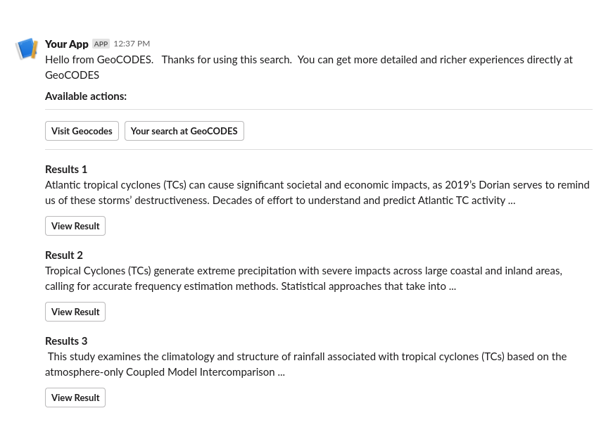

# Zoltan

## About

Boutique search engines must drive engagement to become part of a user's habit.  This means 
being ubiquitous and low friction.  Be where the users are, don't expect them to come.  
Their email, their messaging, etc.   This work is one small exploration of that larger process.
It will never be as cool at the
real [Zoltan](http://www.pinrepair.com/arcade/zoltan.htm) though!

The command would look something like this, simply typed into the message block.

```bash
/geocodes   Atlantic tropical cyclones
```

The results would look something like:


## Test command notes

```bash
❯ curl -X POST  --header "Content-Type: application/x-www-form-urlencoded"  'http://localhost:6789/query'  --data @./docs/testPackage.txt
Zoltan is on it!    
```

## ActivityPub

It is worth looking at works like [littr](https://github.com/mariusor/go-littr) and [Golang ActivityPub](https://github.com/go-ap) to see
how ActivityPub might be leveraged in this code analogous to RSS approaches.

## References

* [Webhhok.site](https://webhook.site/#!/)
* [Example Slack Builder](https://app.slack.com/block-kit-builder/T092JLYMR#%7B%22blocks%22:%5B%7B%22type%22:%22section%22,%22text%22:%7B%22type%22:%22mrkdwn%22,%22text%22:%22Hello%20from%20GeoCODES.%20%20%20Thanks%20for%20using%20this%20search.%20%20You%20can%20get%20more%20detailed%20and%20richer%20experiences%20directly%20at%20GeoCODES%20%5Cn%5Cn%20*Available%20actions:*%22%7D%7D,%7B%22type%22:%22divider%22%7D,%7B%22type%22:%22actions%22,%22elements%22:%5B%7B%22type%22:%22button%22,%22text%22:%7B%22type%22:%22plain_text%22,%22text%22:%22Visit%20Geocodes%22,%22emoji%22:true%7D,%22value%22:%22click_me_123%22,%22url%22:%22https://google.com%22%7D,%7B%22type%22:%22button%22,%22text%22:%7B%22type%22:%22plain_text%22,%22text%22:%22Your%20search%20at%20GeoCODES%22,%22emoji%22:true%7D,%22value%22:%22click_me_123%22,%22url%22:%22https://google.com%22%7D%5D%7D,%7B%22type%22:%22divider%22%7D,%7B%22type%22:%22section%22,%22text%22:%7B%22type%22:%22mrkdwn%22,%22text%22:%22*Results%201*%5Cn%20Atlantic%20tropical%20cyclones%20(TCs)%20can%20cause%20significant%20societal%20and%20economic%20impacts,%20as%202019%E2%80%99s%20Dorian%20serves%20to%20remind%20us%20of%20these%20storms%E2%80%99%20destructiveness.%20Decades%20of%20effort%20to%20understand%20and%20predict%20Atlantic%20TC%20activity%20...%22%7D%7D,%7B%22type%22:%22actions%22,%22elements%22:%5B%7B%22type%22:%22button%22,%22text%22:%7B%22type%22:%22plain_text%22,%22text%22:%22View%20Result%22,%22emoji%22:true%7D,%22value%22:%22click_me_123%22,%22url%22:%22https://google.com%22%7D%5D%7D,%7B%22type%22:%22section%22,%22text%22:%7B%22type%22:%22mrkdwn%22,%22text%22:%22*Result%202*%5Cn%20Tropical%20Cyclones%20(TCs)%20generate%20extreme%20precipitation%20with%20severe%20impacts%20across%20large%20coastal%20and%20inland%20areas,%20calling%20for%20accurate%20frequency%20estimation%20methods.%20Statistical%20approaches%20that%20take%20into%20...%20%22%7D%7D,%7B%22type%22:%22actions%22,%22elements%22:%5B%7B%22type%22:%22button%22,%22text%22:%7B%22type%22:%22plain_text%22,%22text%22:%22View%20Result%22,%22emoji%22:true%7D,%22value%22:%22click_me_123%22,%22url%22:%22https://google.com%22%7D%5D%7D,%7B%22type%22:%22section%22,%22text%22:%7B%22type%22:%22mrkdwn%22,%22text%22:%22*Results%203*%5Cn%20%20This%20study%20examines%20the%20climatology%20and%20structure%20of%20rainfall%20associated%20with%20tropical%20cyclones%20(TCs)%20based%20on%20the%20atmosphere-only%20Coupled%20Model%20Intercomparison%20...%22%7D%7D,%7B%22type%22:%22actions%22,%22elements%22:%5B%7B%22type%22:%22button%22,%22text%22:%7B%22type%22:%22plain_text%22,%22text%22:%22View%20Result%22,%22emoji%22:true%7D,%22value%22:%22click_me_123%22,%22url%22:%22https://google.com%22%7D%5D%7D%5D%7D)
* [Example Slack Builder 2](https://app.slack.com/block-kit-builder/T092JLYMR#%7B%22blocks%22:%5B%7B%22type%22:%22section%22,%22text%22:%7B%22type%22:%22mrkdwn%22,%22text%22:%22Thanks%20for%20using%20GeoCODES.%20%20The%20following%20are%20the%20top%203%20results%20%20See%20more%20results%20at%20%3Chttps://geocodes.org%7CGeoCODES%3E%22%7D%7D,%7B%22type%22:%22divider%22%7D,%7B%22type%22:%22section%22,%22text%22:%7B%22type%22:%22mrkdwn%22,%22text%22:%22*%3CfakeLink.toHotelPage.com%7CWindsor%20Court%20Hotel%3E*%5Cn$340%20per%20night%5CnRated:%209.4%20-%20Excellent%22%7D%7D,%7B%22type%22:%22divider%22%7D,%7B%22type%22:%22section%22,%22text%22:%7B%22type%22:%22mrkdwn%22,%22text%22:%22*%3CfakeLink.toHotelPage.com%7CThe%20Ritz-Carlton%20New%20Orleans%3E*%5Cn$340%20per%20night%5CnRated:%209.1%20-%20Excellent%22%7D%7D,%7B%22type%22:%22divider%22%7D,%7B%22type%22:%22section%22,%22text%22:%7B%22type%22:%22mrkdwn%22,%22text%22:%22*%3CfakeLink.toHotelPage.com%7COmni%20Royal%20Orleans%20Hotel%3E*%5Cn$419%20per%20night%5CnRated:%208.8%20-%20Excellent%22%7D%7D%5D%7D)

## ToDo

* need to have the call back URL in the command line or implement a simple config sript
* RSS implementation whre either I just generate out results based on date time or date time mixed with qyery results
* would there be some way to do special update pages (obscure URL) or email?

